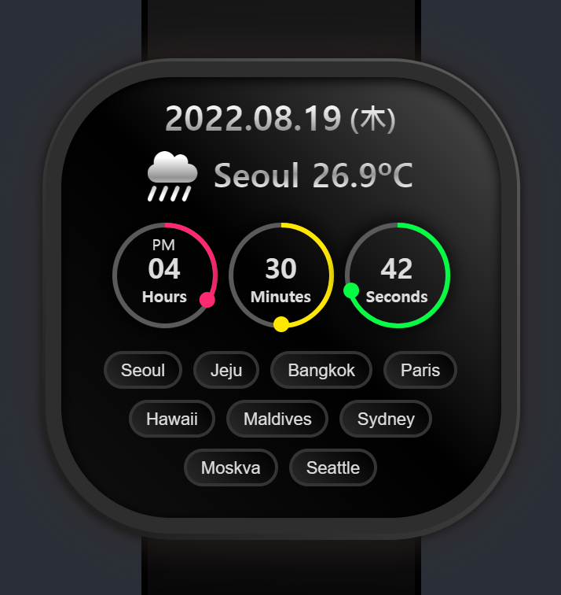

# Clock SVG


https://youtu.be/eoSfzVz9ur0


```js
const round = hh.getTotalLength(); /* 둘레길이 */

hh.style.strokeDashoffset = round - (round * h) / 12;
mm.style.strokeDashoffset = round - (round * m) / 60;
ss.style.strokeDashoffset = round - (round * s) / 60;

dothh.style.transform = 'rotate('+ h * 360 / 12 +'deg)';
dotmm.style.transform = 'rotate('+ m * 360 / 60 +'deg)';
dotss.style.transform = 'rotate('+ s * 360 / 60 +'deg)';
```


